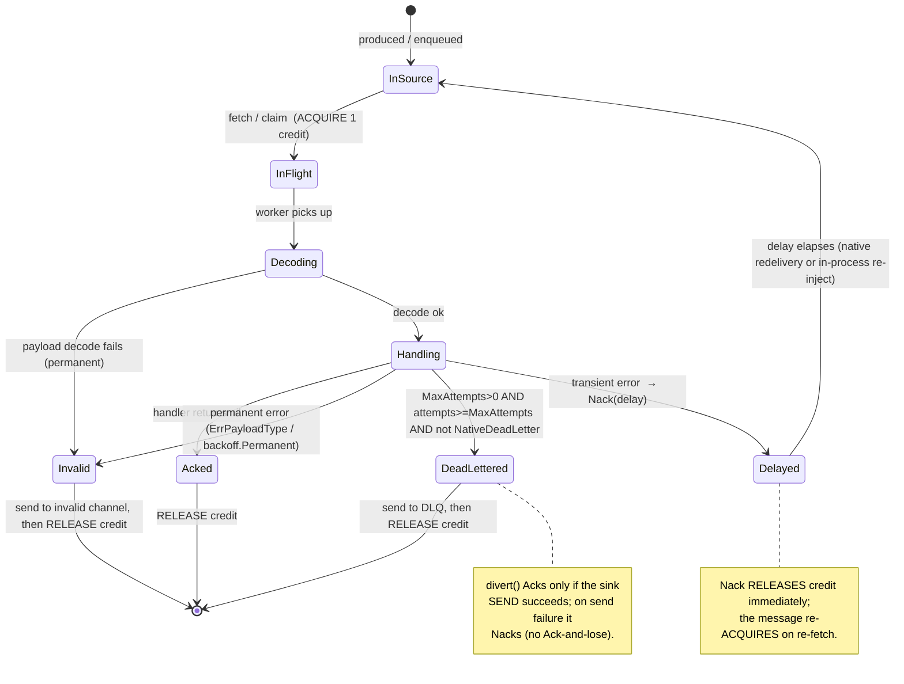

# MESSAGING.md — EIP design & research for `msgin`

> **What this is.** The readable, narrative companion to the formal spec. It grounds `msgin` in the
> pattern language of Gregor Hohpe & Bobby Woolf's *Enterprise Integration Patterns* (EIP) — the
> conceptual model of Spring Integration — and then walks through the design we settled on, with
> diagrams for the parts that are easier shown than told (the **message settlement lifecycle** and the
> **credit / flow-control** model).
>
> **Authority.** This document explains and motivates; the **normative source is the spec and ADRs**:
> [`docs/specs/001-messaging-core.md`](docs/specs/001-messaging-core.md) and ADRs
> [0001](docs/adrs/0001-message-payload-typing.md)–[0006](docs/adrs/0006-resilience-flow-control.md).
> Where this doc and the spec disagree, the spec wins.
>
> **Primary research source.** <https://www.enterpriseintegrationpatterns.com/> (accessed 2026-07-16).
>
> **Status.** Design settled and hardened through **two independent design audits** (see Part 8). The
> six adapters, the reliability model, and the resilience/flow-control model are first-phase scope.

**Scope reminder.** `msgin` ships the pattern *core* plus six channel adapters — **in-memory**, **SQL**
(`database/sql`, generic; v1 dialects Postgres + MySQL), **pgx** (PostgreSQL-native, incl.
`LISTEN`/`NOTIFY`), **Redis**, **NATS**, and **HTTP** (request-reply / async / outbound webhook) — and
stays open for community adapters (Kafka, RabbitMQ, …) through a stable SPI. Retry uses closed-form
backoff throughout, on both the inbound settlement and outbound producer paths; time uses
`clockwork`. It is a library, not
a broker, ESB, or workflow engine.

---

## Part 1 — The EIP pattern language, mapped

EIP is a language of ~65 patterns in six groups. The ones that bear on `msgin`:

| Group | Patterns (condensed) | Relevance |
| --- | --- | --- |
| **Message Construction** | Message; Command / Document / Event Message; Request-Reply; Correlation Identifier; Message Expiration; Format Indicator | **Core** — the envelope & headers; drives payload typing. |
| **Messaging Channels** | Message Channel; Point-to-Point; Publish-Subscribe; Datatype Channel; Invalid Message Channel; Dead Letter Channel; Guaranteed Delivery; **Channel Adapter**; Messaging Bridge | **Core** — the conduit, the adapter extension point, reliability. |
| **Messaging Endpoints** | Message Endpoint; Messaging Gateway; **Polling Consumer**; **Event-Driven Consumer**; Competing Consumers; Idempotent Receiver; Transactional Client; Service Activator | **Core** — how app code & adapters attach; drives the SPI. |
| **Message Routing** | Router, Filter, Splitter, Aggregator, Recipient List, … | **Later** — composable endpoints built *on* the core (deferred). |
| **Message Transformation** | Message Translator; Content Enricher; **Canonical Data Model** | **Informs typing** — fixed vs agnostic payload. |
| **System Management** | Control Bus; Wire Tap; Message History; Message Store | **Later / optional** — ops hooks. |

**Reading:** first-phase scope is *Message Construction* + *Messaging Channels* + a subset of
*Messaging Endpoints* (producer/consumer/adapter machinery). Routing & transformation endpoints layer
on top later without breaking the SPI — the same layering Spring Integration uses.

## Part 2 — Patterns in scope, and how they map to Go

- **Message** (header + opaque body; Command/Document/Event intents) → an **immutable** `Message[T]`
  envelope: typed payload + a `Headers` metadata set. Immutability lets one message be read
  concurrently with no copy/lock.
- **Message Channel** (Point-to-Point vs Publish-Subscribe) → Go channels, but the *semantics* differ:
  P2P ≈ many workers receiving from one queue (Go already delivers each value to exactly one receiver);
  pub-sub needs explicit fan-out (deferred to a later release).
- **Channel Adapter** (inbound/outbound, connects an external system) → **the SPI**, the reason `msgin`
  exists. Inbound emits messages onto a channel; outbound writes them out.
- **Polling Consumer vs Event-Driven Consumer** → the two inbound SPI shapes: a pulled `PollingSource`
  (driven by a shared Poller) and a pushed `StreamingSource` (owns its blocking loop). DB polls; Redis
  `BRPOP` / NATS push / pgx `LISTEN` stream.
- **Guaranteed Delivery + Transactional Client + Idempotent Receiver** → the reliability model: per-
  adapter **at-least-once vs at-most-once** contracts, ack/nack, and consumer-side idempotency via a
  stable `msgin.id`.
- **Invalid Message Channel + Dead Letter Channel** → the runtime's **invalid-message** path (malformed
  / permanent errors) and **dead-letter** path (retries exhausted).
- **Competing Consumers** → the worker pool (`WithConcurrency(N)`): each message to exactly one worker.
- **Datatype Channel** → the argument *for* generics (`Channel[T]` as a compile-time type contract).
- **Canonical Data Model** → the argument to standardize the *envelope*, not the *business body* —
  hence payload-agnostic core + typed caller API.

## Part 3 — The `msgin` design (synthesis)

The vocabulary is EIP's; the shape is idiomatic Go. The design has **three layers** and **two
independent encodings** placed deliberately in different layers.

```
Layer 1 — CALLER (typed, generic)     Message[T] · Producer[T] · Consumer[T] · Handler[T]
   │  PAYLOAD CODEC  (T ⟷ []byte)     performed by the RUNTIME, which KNOWS T
Layer 2 — SPI (untyped, monomorphic)  Message[any] · PollingSource · StreamingSource · OutboundAdapter · Delivery
   │  ENVELOPE FRAMING  (hdrs+body ⟷ storage)   performed by the ADAPTER, type-agnostic
Layer 3 — BACKEND                     memory · sql · pgx · redis · nats · http
```

Dependency points **inward** (L3 → L2 → L1); the core never imports an adapter.

**The two encodings** (this is the subtle bit an audit caught early — see Part 8, C1):

- **Payload codec — `T` ⟷ `[]byte`.** Business (de)serialization (JSON, proto). It *needs* `T`, so it
  lives in the typed **runtime**. On send it encodes `T`→`[]byte`; on receive it decodes `[]byte`→`T`.
  A wire adapter never sees `T`.
- **Envelope framing — `(headers, body-bytes)` ⟷ storage.** How headers + an opaque body map into the
  backend (Redis stream fields, SQL columns, NATS headers+data, HTTP headers+body). Type-agnostic;
  lives in the **adapter**.

The SPI payload is `any`: `[]byte` for wire adapters, or the **live Go value** for the in-memory
adapter (no codec, zero-copy). The runtime decides decode-vs-assert by whether a `PayloadCodec` is
configured; a small `LiveValueSource` capability lets `memory` declare itself so the pairing is
validated at construction.

**Typed at the edges, uniform in the middle, plain at the adapter** — that is the whole ergonomic bet:
callers get compile-time types (`Message[Order]`), the runtime handles serialization/reliability/flow
once, and a new adapter author implements a plain non-generic interface plus envelope framing.

## Part 4 — Message lifecycle & settlement

Every inbound message flows through one lifecycle. **Settlement** is the message reaching a *terminal
outcome* — the runtime telling the backend what happened. There are two settle verbs on a `Delivery`:

- **`Ack`** — "done, remove it" (delete the row / `XACK` / `msg.Ack()`).
- **`Nack(requeue, delay)`** — "failed, redeliver after `delay`" (or drop).

The runtime chooses the outcome from the handler result, in this **guarded order**:



Key rules the audits pinned down:

- **`MaxAttempts == 0` means retry forever** — it must *not* dead-letter. The dead-letter branch is
  guarded `MaxAttempts > 0 && attempts >= MaxAttempts && !NativeDeadLetter()`. **This is the *inbound*
  settlement path.** On the **outbound** path (`WithProducerRetry`, ADR 0025) the same policy reads
  differently, because a retry there is a live re-send on the caller's goroutine rather than a
  broker redelivery: an always-on 2-minute budget makes `MaxAttempts == 0` finite (`ErrRetryBudgetExhausted`
  marks a budget stop), every wait is floored to 100 ms, and the `RetryPolicy` **zero value** is rejected
  outright with `ErrUnboundedRetry`. See `retry.go`'s godoc.
- **Permanent errors never retry** — a payload that can't decode into `T`, or a
  `backoff.Permanent(err)`, goes straight to the **invalid-message channel** (it will never succeed;
  retrying it forever is the classic poison loop).
- **Diverting to a sink is safe** — `divert()` `Ack`s only if the invalid/DLQ **send succeeds**; on
  send failure it `Nack`s, so a message is never removed from the source without landing somewhere.
- **Attempt counting** prefers a native `msgin.delivery-count` header; every `NativeRedelivery()`
  backend must populate it (e.g. the SQL lease's `delivery_count` column), so a count can't reset
  across the process-exit gap.

## Part 5 — Credit & flow control (resilience, first phase)

This is the resilience heart, and the part most worth understanding. Requirement: **a flood of inbound
messages must not hammer the system or a downstream** — most acutely, a huge backlog suddenly appearing
in the SQL message table.

### Why polling makes the flood the *easy* case

For a `PollingSource` (sql/pgx) the **runtime controls the pull rate** — nothing pushes into `msgin`.
So the defense is simply: *don't pull more than you can process.* The surplus stays **durably in the
source** (the DB table) until `msgin` is ready. The database *is* the buffer.

### Credit = a bucket of `n` tokens (`WithMaxInFlight(n)`)

```
                ┌──────────────  credit bucket: n tokens  ──────────────┐
  fetch/claim   │                                                       │   terminal settle
  ────────────► │  take 1 token per message claimed                     │  ◄────────────────
  (blocked when │  poller fetches min(maxBatch, n − inFlight)           │   return 1 token
   bucket empty)│  → never over-pulls past n                            │   on Ack / DLQ /
                └───────────────────────────────────────────────────────┘   Invalid / **Nack**
                         ▲                                    │
                  ACQUIRE at FETCH                     RELEASE at EVERY
                  (not at dispatch — a buffered        terminal settle,
                   message already holds a token)      exactly once, guarded
```

The two invariants (both were audit findings — Part 8, NF-4/NF-5):

1. **Acquire at fetch/claim, not at dispatch.** The moment the poller pulls `k` messages, `n` drops by
   `k` — even before a worker picks them up. Otherwise the poller keeps seeing "0 in flight" and
   over-pulls into the buffer.
2. **Release on *every* terminal settle, including `Nack`.** A Nacked message has *left* (back to the
   source, or into a separately-bounded delay-park); holding its token while it sleeps a backoff would
   let a failure burst pin all `n` tokens and starve the poller of healthy work → throughput collapse.
   It re-acquires a fresh token when redelivered.

Get acquire/release wrong one way → tokens **leak** (throughput slowly throttles to zero); wrong the
other way → **over-release** (the `n` bound breaks, flood defense fails). Because this accounting is
global and touches every settle path, it is the single highest-risk unit and a dedicated test target.

### The SQL flood, concretely

> 1,000,000 rows land in the message table. With `WithMaxInFlight(100)`: the poller can fetch at most
> `100 − inFlight` rows, so ~100 messages are ever in the process; the other ~999,900 wait durably in
> the table. Memory stays flat, the downstream sees ~100 concurrent, throughput self-limits to handler
> capacity. As messages settle, tokens free and the poller fetches more.

### The full governor stack (ingress → egress)

```
rate-limit ─► CREDIT GATE (acquire@fetch) ─► bounded buffer ─► worker pool ─► handler (under timeout)
   (opt)        (mandatory flood defense)      (size n)        (WithConcurrency)   │
                                                                                   ▼
                         circuit breaker gates BOTH ingress and dispatch     Ack / Nack / DLQ / Invalid
                         (open ⇒ pause poller AND stop draining buffer)            │ release credit
```

- **`WithMaxInFlight(n)`** — credit gate (mandatory, always bounded). The flood defense.
- **`WithRateLimit(RateLimiter)`** — optional token-bucket rps/burst cap; default clockwork-driven, no
  forced dep; plug `x/time/rate` if preferred.
- **`WithConcurrency(n)`** — worker-pool size (Competing Consumers).
- **`WithHandlerTimeout(d)`** — a stuck handler is cancelled → transient failure (for the SQL lease,
  lease TTL must exceed `d`).
- **`WithCircuitBreaker(cb)`** — on repeated downstream failure, **gate dispatch, not just ingress**
  (park/Nack the buffer too), cool down, half-open with an explicit wakeup; default clockwork-driven,
  no forced dep; plug `sony/gobreaker`.
- **`WithOverflow(policy)`** — for un-pausable push firehoses: `Block` (default) / `DropNewest` /
  `DropOldest` / `Reject` (HTTP 503/429); a dropped message is Nacked + credit released.

**No new forced dependencies:** rate-limit and circuit-breaker are interfaces with small
`clockwork`-driven defaults, so every governor is deterministically testable and the minimal-deps
mandate holds.

## Part 6 — The six adapters

| Adapter | Import path | Module | Inbound shape(s) | Delivery guarantee |
| --- | --- | --- | --- | --- |
| **memory** | `adapter/memory` | core | push | at-most-once |
| **sql** | `adapter/database/sql` | core | pull | at-least-once |
| **pgx** | `adapter/database/pgx` | own | pull **and** push (`LISTEN`/`NOTIFY`) | at-least-once |
| **redis** | `adapter/redis` | own | push | list: at-most-once · streams: at-least-once |
| **nats** | `adapter/nats` | own | push **and** pull | core: at-most-once · JetStream: at-least-once |
| **http** | `adapter/http` | core | push | inbound: async at-most-once / sync at-least-once *iff client retries* · outbound: at-least-once |

- **memory** — Go channel; live value, zero-copy; reference adapter & test double.
- **sql** — generic `database/sql` (v1 dialects Postgres + MySQL via a `Dialect` seam). Two selectable
  strategies: **lease/claim** (default — `delivery_count` + `lease_epoch` fence token, short claim tx,
  `visible_after` for delay, a reaper for crash recovery; batches, honors delay, no held connection) and
  **lock/`FOR UPDATE`** (tx held across processing, crash-auto-release, single-row; in-flight coupled to
  the DB pool size). `Dialect` validates/quotes identifiers (no injection).
- **pgx** — Postgres-native (`jackc/pgx/v5`) + wire-compatible derivatives; `LISTEN`/`NOTIFY` makes it
  event-driven (`pgx.NewNotifySource`) alongside polling (`pgx.NewPollSource`); `pgxpool`, `COPY` bulk.
- **redis** — list (`LPUSH`/`BRPOP`, at-most-once) or streams (`XADD`/`XREADGROUP`/`XACK`, consumer
  groups, native redelivery via the PEL; `Nack` delay → `XCLAIM` min-idle).
- **nats** — core subject pub/sub (at-most-once) or JetStream (pull/push, at-least-once; `Ack`/`Nak`/
  `Term`; `Nack` delay → `NakWithDelay`; no native DLQ → runtime DLQ policy).
- **http** — inbound `http.Handler`/server: **sync request-reply** (handler blocks until settle;
  `Ack`→2xx, transient `Nack`→5xx, permanent→4xx; request-ctx cancels on client disconnect) or **async**
  (202); outbound webhook `POST` retried by the **core producer** (`WithProducerRetry`) honoring
  `Retry-After` as a **minimum** wait. *Amended per ADR 0025:* the retry lives in core, not in the
  adapter, and `cenkalti/backoff` is **not** adopted — see Part 7.

**Consumer groups** (cross-instance competing consumers) are delivered by the backends — Redis Streams
groups, NATS JetStream durables, SQL `SKIP LOCKED` — needing **no SPI change**; only multi-subscriber
publish-subscribe is deferred.

## Part 7 — Decisions & ADRs (all resolved)

| ADR | Decision | Essence |
| --- | --- | --- |
| [0001](docs/adrs/0001-message-payload-typing.md) | Payload typing | Generics on the caller API; **payload codec in runtime**, **envelope framing in adapter** (the two-encoding split). |
| [0002](docs/adrs/0002-adapter-spi.md) | Adapter SPI | Non-generic SPI over `Message[any]`; runtime type-switches on `PollingSource`/`StreamingSource`; `Delivery` w/ `Ack`/`Nack(delay)`; runtime-owned retry + invalid-message + DLQ; `NativeReliability` (redelivery vs dead-letter, independent). |
| [0003](docs/adrs/0003-multi-module-repository-layout.md) | Layout | Multi-module monorepo; core (+ memory + http + sql) + separate modules for pgx/redis/nats; module-path-prefixed release tags. |
| [0004](docs/adrs/0004-clockwork-dependency.md) | Time | `jonboulle/clockwork` directly (deterministic tests). |
| [0005](docs/adrs/0005-cenkalti-backoff-dependency.md) | Backoff | Closed-form exponential for all redelivery (attempt-indexed). ~~`cenkalti/backoff/v4` for the outbound-HTTP tight loop~~ — **that clause is superseded by [0025](docs/adrs/0025-producer-outbound-retry.md)**; the closed-form decision stands. |
| [0006](docs/adrs/0006-resilience-flow-control.md) | Resilience | Credit-based backpressure (mandatory) + rate-limit/breaker/handler-timeout/overflow, as clockwork-driven interfaces with dep-free defaults. |
| [0025](docs/adrs/0025-producer-outbound-retry.md) | Producer retry | `WithProducerRetry` applies `RetryPolicy` to `Producer.Send` in **core**, so every outbound adapter benefits; `RetryAfter(err, d)` marker as a **minimum** wait; four bounds (`ErrUnboundedRetry`, 100 ms floor, always-on budget, timed+detached divert); divert on cancel; at-least-once with caller-visible duplicates. |

**Core third-party dependencies (corrected per ADR 0025 §4):** `clockwork`, `robfig/cron`,
`expr-lang/expr`. **`cenkalti/backoff/v4` is NOT among them** — ADR 0005 ratified it for an
outbound-HTTP loop that never shipped, and the producer-side design reuses the existing
`RetryPolicy`/`ExponentialBackoff` machinery instead, so it stays out of `go.mod`. Everything else is
stdlib or an adapter-module's own client.

## Part 8 — Design audits (what was caught and fixed)

The design was hardened by **two independent Opus audits before any code** — the value of which is
that the highest-risk parts (the type seams, the settlement switch, credit accounting) were corrected
on paper, cheaply.

**First audit — 2 critical + 7 high + 7 medium.** The load-bearing catches:
- **C1** — the original "codec inside the wire adapter" could not produce a typed payload (the adapter
  has `[]byte` but not `T`); `Payload.(T)` would fail on every wire message. → the two-encoding split.
- **C2** — a sealed `Source interface{ isSource() }` marker cannot be implemented by out-of-package
  adapters (i.e. all of them) → won't compile. → runtime type-switch on the exported interfaces.
- Plus H-level: DLQ-vs-native-redelivery ordering, backoff modeling, the SQL tx-across-worker-pool
  hazard, HTTP sync lifecycle, a missing invalid-message path, mutable headers.

**Second audit — caught real bugs in the *first* revision.** The most important:
- **NF-1** — `MaxAttempts == 0` (retry forever) would dead-letter on the first error and nil-panic. →
  finiteness guard.
- **NF-4 / NF-5** — credit acquired at the wrong time (over-pull) and not released on `Nack` (deadlock
  under failure burst). → acquire-at-fetch, release-on-every-settle.
- **NF-3** — DLQ/invalid **send failure** unhandled → silent loss or poison loop. → Ack only on
  successful sink send.
- **NF-2 / NF-8** — attempt-count durability + a SQL **lease fence token** so a slow handler can't
  corrupt settlement.

Both audit reports and this fix history are why the credit/settlement core is specified as precisely as
it is — and why it is the first thing to test-drive during implementation.

## Part 9 — Source index

Enterprise Integration Patterns (enterpriseintegrationpatterns.com): Message · Message Channel ·
Point-to-Point · Publish-Subscribe · Datatype Channel · Invalid Message Channel · Dead Letter Channel ·
Guaranteed Delivery · Channel Adapter · Message Endpoint · Messaging Gateway · Polling Consumer ·
Event-Driven Consumer · Transactional Client · Competing Consumers · Idempotent Receiver · Canonical
Data Model. Libraries: `github.com/jonboulle/clockwork`, `github.com/robfig/cron/v3`,
`github.com/expr-lang/expr`, `github.com/jackc/pgx/v5`, `github.com/redis/go-redis`,
`github.com/nats-io/nats.go`.
